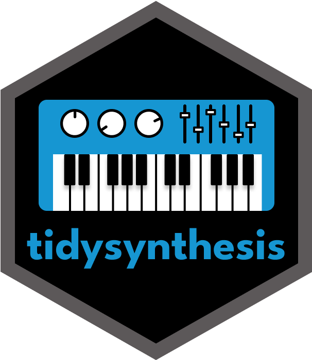
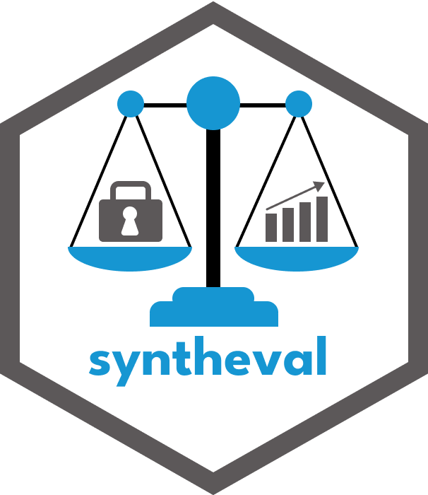

## `tidysynthesis` and `syntheval` Demo

By Aaron R. Williams and Jeremy Seeman

This brief demonstration introduces the [tidysynthesis](https://github.com/UrbanInstitute/tidysynthesis) and [syntheval](https://github.com/UrbanInstitute/syntheval) R packages for generating and evaluating synthetic data. The [tidysynthesis documentation website](https://ui-research.github.io/tidysynthesis-documentation/) contains additional information.

  
  

### Download Instructions to Run Code

1.  Download the entire repository by clicking "Code" \> "Download ZIP."
2.  Move the folder to a meaningful place on your computer. Do not place the folder in a cloud drive.
3.  Extract the contents of the zipped folder.
4.  Double click tidysynthesis-demo.Rproj. This should open RStudio.

**You can clone the repository if you are comfortable with Git.**

### Download Instructions to Follow Along

1.  Download the entire repository by clicking "Code" \> "Download ZIP."
2.  Move the folder to a meaningful place on your computer.
3.  Double click 01_demo.html. The materials should open in your web browser.

### Setup Instructions

1.  Open and run the R code in 00_setup.R to install the required R software.
2.  Open 01_demo.qmd.

### Requirements

-   R 4.0.0 or greater ([Install link](https://cran.r-project.org/))
-   RStudio ([Install link](https://posit.co/download/rstudio-desktop/))
